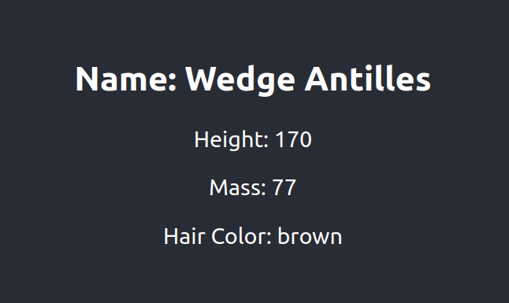

# SPA-loading-starwars

Create a component named `StarWarsCharacter` that retrieves and displays a random Star Wars character from the [Star Wars API](https://swapi.dev/). Before the data is retrieved, a spinner component should be displayed. Use `useEffect` to initiate the data retrieval and manage the loading state of the component.

**Notes:**

1.  Import the required hooks and icons.
2.  Create a `Spinner` component that displays a FontAwesome icon with a spinner.
3.  Create the `StarWarsCharacter` component that uses `useState` and `useEffect`.
4.  Use `fetch` in the `useEffect` function to retrieve data from the Star Wars API.
5.  Display the character data once it is available and ensure that the spinner component is displayed until the data is retrieved.
6.  Add the `StarWarsCharacter` component to your main program.

## Preview

