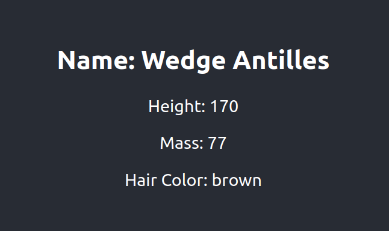

# SPA-loading-starwars

Erstelle eine Komponente namens `StarWarsCharacter`, die eine zufällige Star Wars Figur von der [Star Wars API](https://swapi.dev/) abruft und anzeigt. Bevor die Daten abgerufen werden, sollte eine Spinner-Komponente angezeigt werden. Verwende dabei `useEffect`, um den Datenabruf zu initiieren und um den Ladezustand der Komponente zu verwalten.

**Hinweise:**

1.  Importiere die benötigten Hooks und Icons
2.  Erstelle eine `Spinner`-Komponente, die ein FontAwesome-Icon mit einem Spinner darstellt
3.  Erstelle die `StarWarsCharacter`-Komponente, die `useState` und `useEffect` verwendet
4.  Verwende `fetch` in der `useEffect`-Funktion, um die Daten von der Star Wars API abzurufen
5.  Zeige die Daten des Charakters an, sobald sie verfügbar sind, und stelle sicher, dass die Spinner-Komponente angezeigt wird, bis die Daten abgerufen wurden
6.  Füge die `StarWarsCharacter`-Komponente zu deinem Hauptprogramm hinzu

## Vorschau

